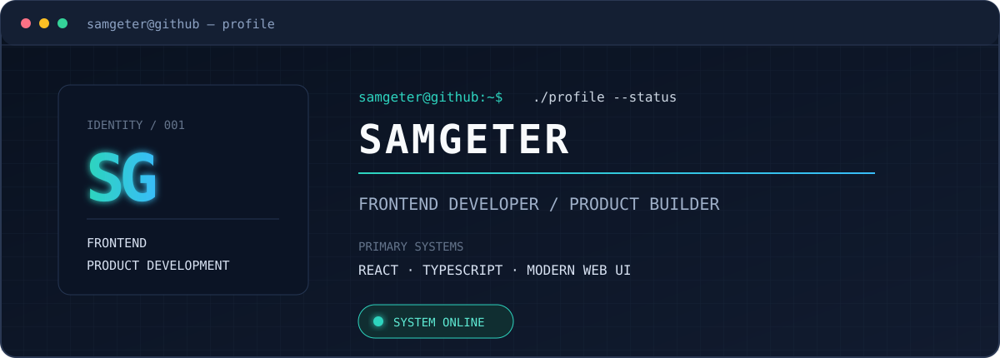
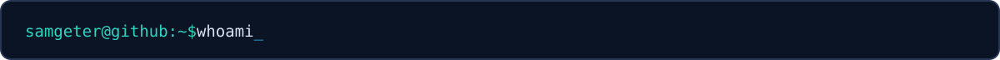
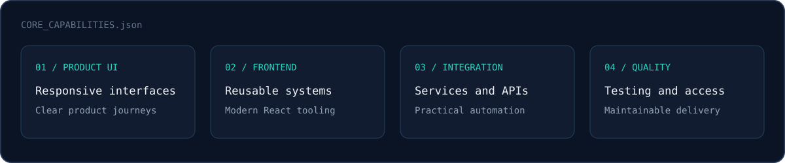
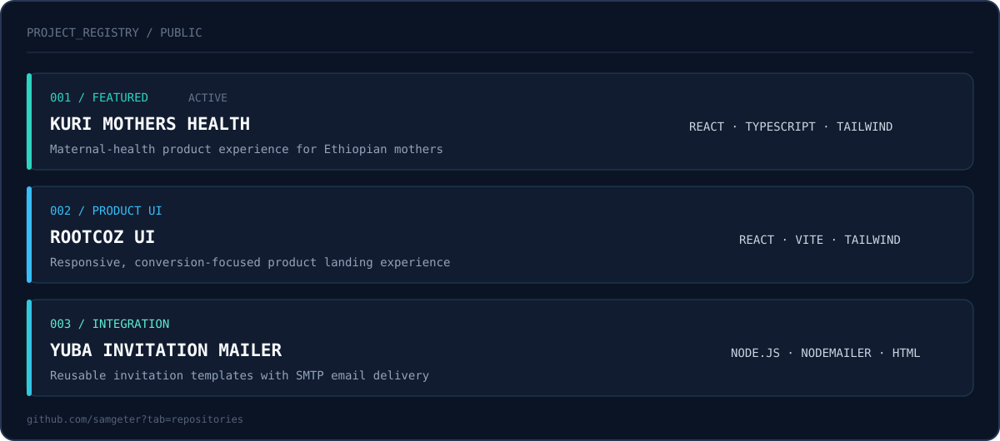
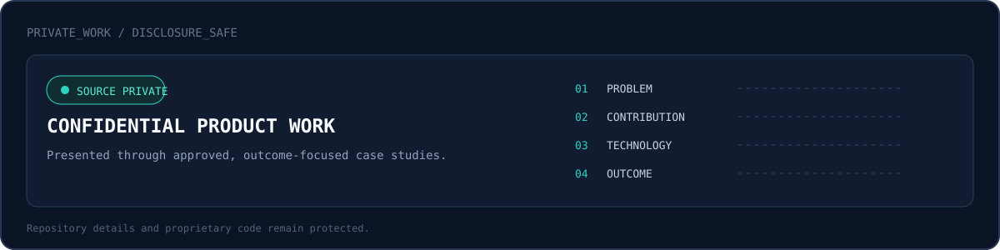
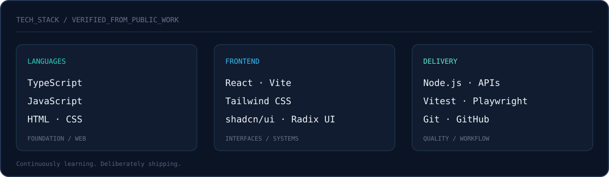
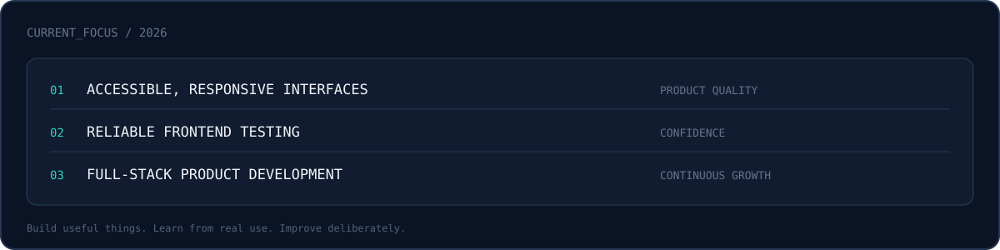
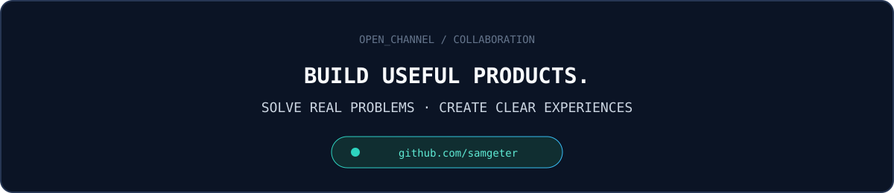

<!--
  SAMGETER — GITHUB PROFILE
  Custom terminal-inspired SVG assets live in ./assets.
  Keep public claims accurate and remove confidential information before publishing.
-->

 

<a href="#about">ABOUT</a> ·
<a href="#projects">PROJECTS</a> ·
<a href="#private-work">PRIVATE WORK</a> ·
<a href="#stack">STACK</a> ·
<a href="#focus">FOCUS</a> ·
<a href="#connect">CONNECT</a>

  

 

## ABOUT

Frontend developer focused on turning product ideas into clear, responsive web experiences.

I work primarily with React and TypeScript, building interfaces, reusable UI systems,
product landing pages, and practical integrations. My recent work spans maternal health,
product design, transactional email, and early-stage digital products.

I care about useful software, thoughtful interaction design, and code that remains easy to
understand as a product grows.

 

## PROJECTS

 

## PRIVATE WORK

Some of my work lives in private repositories. When confidentiality permits, I describe
that work through the problem, my contribution, the technologies used, and the outcome—
without exposing proprietary code or internal information.

 

## STACK

 

## FOCUS

 

## CONNECT

  

Designed as a lightweight, original SVG profile · no visitor counters · no inflated claims

