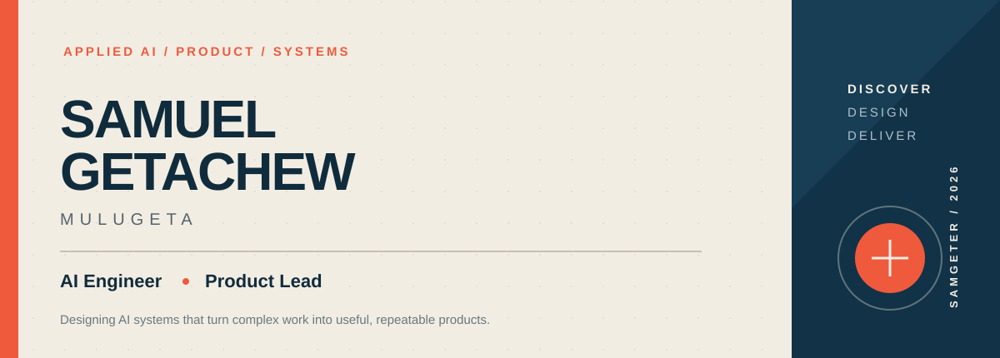
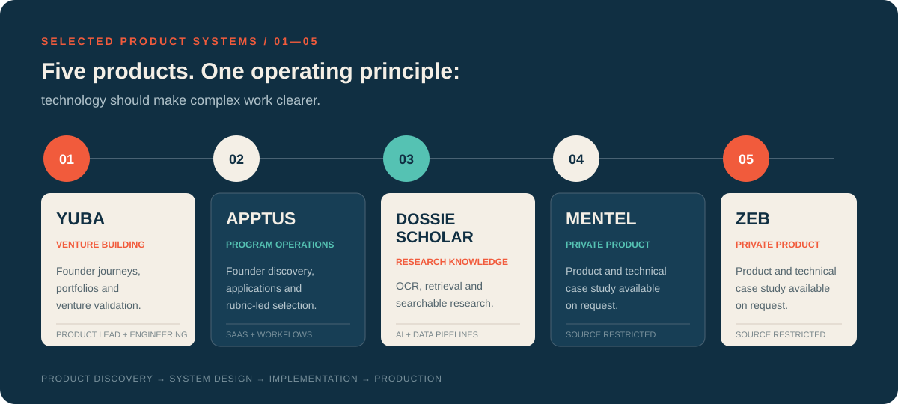
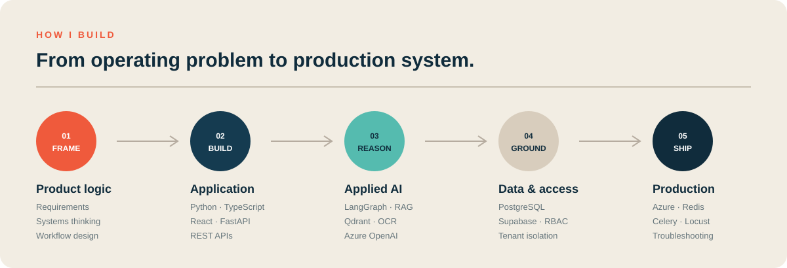
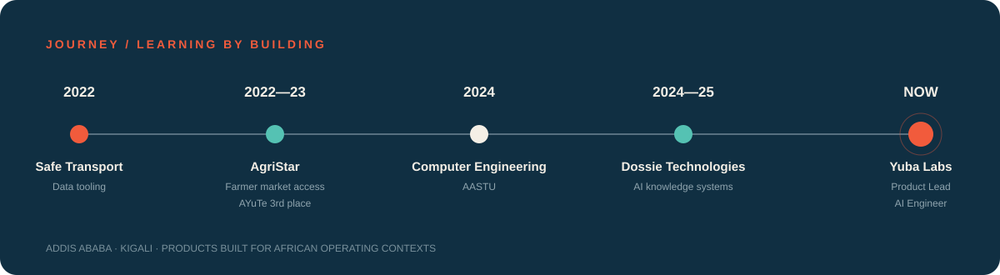

 

[Products](#selected-systems) · [How I build](#how-i-build) · [Journey](#journey) · [GitHub](https://github.com/samgeter)

## Hello

I'm **Samuel Getachew Mulugeta**, an AI engineer and product lead based in East Africa.
I design and build AI-powered SaaS products, internal tools, and workflow-driven systems—from
early product definition and data modelling through deployment and production troubleshooting.

My work sits where product thinking meets engineering: translating an ambiguous operational
problem into a system people can use, measure, and improve.

> Currently: **Product Lead & AI Engineer at Yuba Labs**

## Selected systems

 

### 01 — [Yuba](https://yubanow.com/)

**AI operating system for venture building in Africa**

I designed and led development of Yuba's multi-tenant platform for founders and
entrepreneurship-support organizations. The system supports venture-validation journeys,
cohorts, portfolios, bookings, usage controls, and role-specific workspaces.

`TypeScript` `React` `Supabase` `PostgreSQL` `RBAC` `AI workflows` `API integrations`

---

### 02 — [Apptus](https://app.useapptus.com/)

**Application and selection infrastructure for entrepreneurship programs**

I built production-facing SaaS workflows that help support organizations discover founders,
tailor application requirements, and manage rubric-based selection processes. My work included
role-aware dashboards, multi-organization access, and operational workflow automation.

`TypeScript` `React` `Supabase` `PostgreSQL` `REST APIs` `Multi-tenant SaaS`

---

### 03 — DossieScholar

**AI knowledge platform for university research**

I designed and implemented a pipeline that converts university research papers into structured,
searchable records. The platform combines document ingestion, OCR, retrieval-augmented
generation, vector search, and production cloud services.

`Python` `FastAPI` `OCR` `RAG` `Qdrant` `Azure OpenAI` `Microsoft Azure`

---

### 04 — Mentel

**Private product repository**

Product scope and technical case study available on request.

`Private codebase`

---

### 05 — Zeb

**Private product repository**

Product scope and technical case study available on request.

`Private codebase`

## How I build

 

## Technical toolkit

| Area | Technologies and practices |
| --- | --- |
| **Languages** | Python, TypeScript, JavaScript, SQL |
| **Product engineering** | React, FastAPI, REST APIs, multi-tenant SaaS, workflow automation |
| **Data and access** | PostgreSQL, Supabase, authentication, RBAC, tenant isolation |
| **Applied AI** | LangChain, LangGraph, RAG, Qdrant, Azure OpenAI, OCR workflows |
| **Cloud and operations** | Microsoft Azure, Redis, Celery, Locust, Git, GitHub |

## How I work

- Start with the operating problem, not the feature list.
- Make roles, permissions, and data boundaries explicit early.
- Turn AI output into structured, repeatable workflows.
- Test the paths that affect real users and production operations.
- Document decisions so the system can grow beyond its first builder.

## Journey

 

## Beyond the code

I hold a bachelor's degree in Computer Engineering from Addis Ababa Science and Technology
University and completed Jasiri's residential intensive entrepreneurship program. That mix of
engineering and venture-building experience shapes how I approach products: technically sound,
operationally useful, and grounded in real user needs.

[Explore my GitHub](https://github.com/samgeter) · [See Yuba](https://yubanow.com/)

